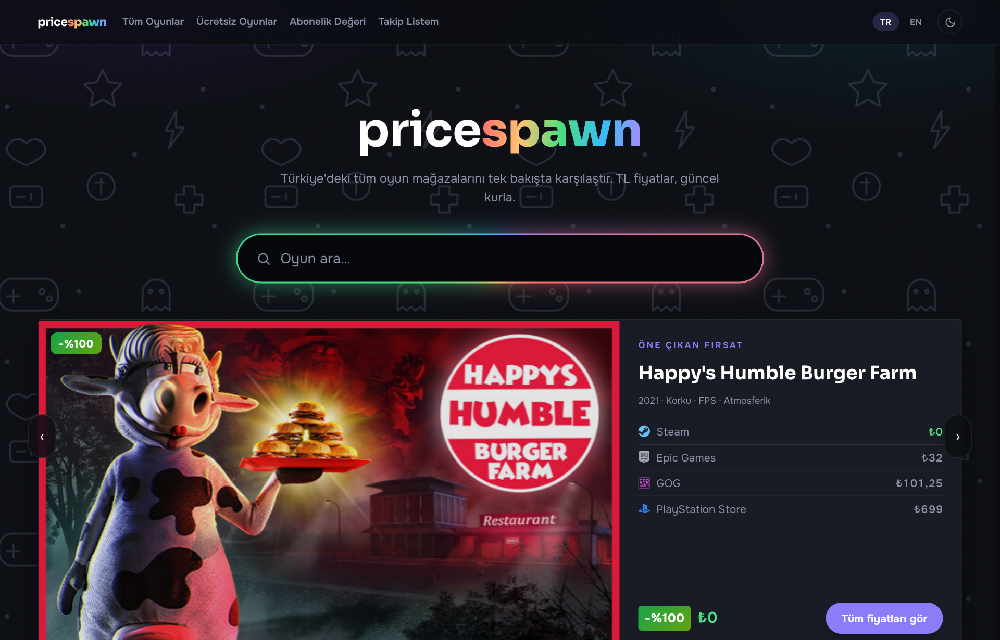
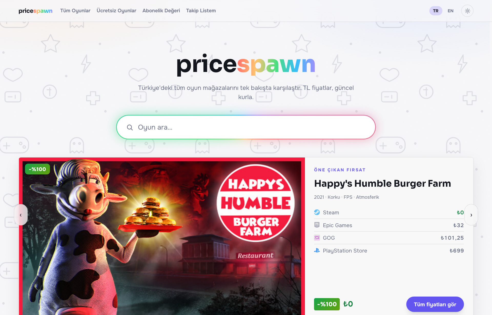
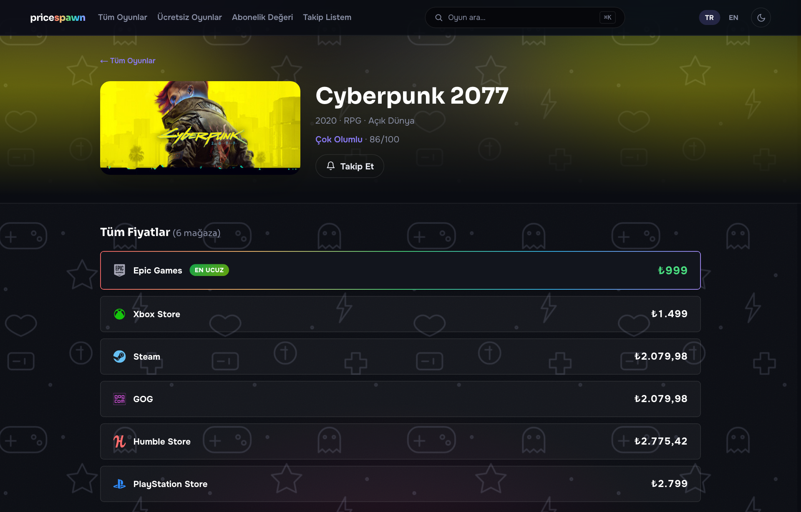
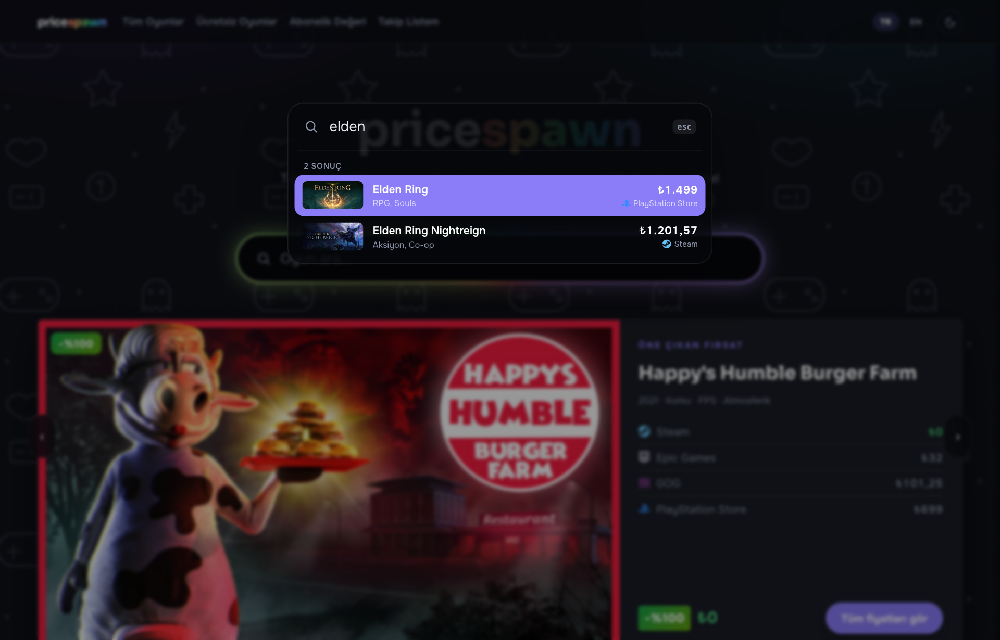
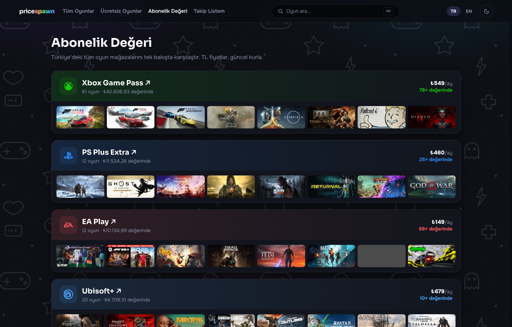

<div align="center">

<br />


<br /><br />

```
██████╗ ██████╗ ██╗ ██████╗███████╗███████╗██████╗  █████╗ ██╗    ██╗███╗   ██╗
██╔══██╗██╔══██╗██║██╔════╝██╔════╝██╔════╝██╔══██╗██╔══██╗██║    ██║████╗  ██║
██████╔╝██████╔╝██║██║     █████╗  ███████╗██████╔╝███████║██║ █╗ ██║██╔██╗ ██║
██╔═══╝ ██╔══██╗██║██║     ██╔══╝  ╚════██║██╔═══╝ ██╔══██║██║███╗██║██║╚██╗██║
██║     ██║  ██║██║╚██████╗███████╗███████║██║     ██║  ██║╚███╔███╔╝██║ ╚████║
╚═╝     ╚═╝  ╚═╝╚═╝ ╚═════╝╚══════╝╚══════╝╚═╝     ╚═╝  ╚═╝ ╚══╝╚══╝ ╚═╝  ╚═══╝
```

### **PriceSpawn** — Hangisi daha ucuz? Türkiye için oyun fiyatı karşılaştırma.

**Gerçek Türkiye fiyatları** · 8 mağaza · 38.380 oyun · tek bakışta en ucuzu bul.

[🚀 Canlı Demo](https://pricespawn-kutluhans-projects-93876a9e.vercel.app) · [⚡ ITAD API](https://docs.isthereanydeal.com/) · [☁️ Vercel](https://vercel.com)

</div>

---

## ✦ Genel Bakış

**PriceSpawn**, bir oyunun **Türkiye'deki tüm dijital mağazalardaki gerçek TL fiyatını** tek
sayfada karşılaştıran bir fiyat takip sitesidir. Kullanıcı oyunu arar; site Steam, Epic,
GOG, Xbox, Ubisoft, Humble ve PlayStation fiyatlarını yan yana gösterir ve **en ucuzunu**
vurgular. İndirimler, abonelik dahilliği (Game Pass vb.), tarihî en düşük fiyat ve ücretsiz
oyunlar da gerçek veriyle gelir. Hesap/giriş yoktur — sadece bakılır.

> **Buradaki hiçbir fiyat sahte değildir.** Fiyatlar, indirimler, tarihî dipler ve ücretsiz
> oyunlar canlı API'lerden çekilir ve günlük cron ile güncellenir.

<div align="center">


</div>

---

## ⚡ Öne Çıkan Özellikler

| Özellik | Açıklama |
|--------|----------|
| 🔴 **Gerçek TR Fiyatları** | 8 mağazanın canlı Türkiye fiyatı; sahte/dolar-tahmini yok. |
| 🏷️ **Gerçek İndirimler** | Mağazaların anlık indirim yüzdeleri (ITAD `cut`). |
| 📉 **Tarihî En Düşük** | Her oyunun gerçek tüm-zamanların-en-düşük fiyatı, mağaza + tarihle. |
| 🎁 **Canlı Ücretsiz Oyunlar** | Epic'te şu an ücretsiz olan oyunlar (keysiz public API). |
| 🌈 **Aurora Arama + ⌘K Palet** | Apple Spotlight tarzı komut paleti, Türkçe-duyarlı arama. |
| 🎨 **Çift Tema + Çizim Arka Plan** | Dark / Light / Sistem; oyun temalı doodle deseni. |
| 💸 **Abonelik Değer Hesabı** | Game Pass, PS Plus, EA Play... kaç oyun, ne değerde. |
| 🔔 **Fiyat Alarmı** | localStorage takip listesi + hedef fiyat (giriş yok). |
| 🌍 **TR / EN + Kur Çevirisi** | İki dil; canlı USD/TRY kuruyla TL formatı. |

<div align="center">

</div>

---

## 🗂️ Veri Nereden Geliyor? (Gerçeklik)

Tüm fiyat verisi **canlı API'lerden** gelir, günlük Vercel cron ile yenilenir ve Neon
Postgres'te tutulur. Demo/sentetik veri **yoktur** (tek istisna: 90 günlük geçmiş eğrisi
gerçek snapshot'larla **birikmektedir** — dürüstçe etiketlidir).

| Kaynak | Ne için | Yöntem | Gerçek mi? |
|--------|---------|--------|:---:|
| **IsThereAnyDeal** | Steam · Epic · GOG · Xbox · Ubisoft · EA App · Humble TR fiyatı | `games/prices/v3?country=TR` (Steam appid → ITAD id) | ✅ |
| **IsThereAnyDeal** | Tarihî en düşük fiyat | `games/storelow/v2?country=TR` | ✅ |
| **PlayStation Store** | PS Store TR fiyatı | Arama sayfası `__NEXT_DATA__` JSON'undan ayrıştırma | ✅ |
| **Steam appdetails** | Katalog: başlık, tür, yıl, puan, kapak | `api/appdetails` (oyun ekleme/üretim) | ✅ |
| **Epic Games** | Şu an ücretsiz oyunlar | `freeGamesPromotions?country=TR` (keysiz) | ✅ |
| **open.er-api.com** | Canlı USD/TRY kuru | `v6/latest/USD` | ✅ |

**Katalog nasıl büyüdü?** Oyunlar elle yazılmadı — ITAD'ın trending TR fırsat listesinden
(`deals/v2`) toplandı, her oyunun `games/info/v2` bilgisiyle **gerçek Steam appid + başlık +
etiket + inceleme puanı** çekilip otomatik eklendi.

---

## 📊 Canlı Kapsam

> 38.380 katalog oyunu

| Mağaza | Oyun Sayısı | Kaynak |
|--------|:--:|--------|
| 🟦 Steam | **38380** | ITAD |
| 🟥 Humble Store | **6222** | ITAD |
| 🟪 GOG | **4195** | ITAD |
| ⬜ Epic Games | **3041** | ITAD |
| 🟦 PlayStation Store | **1492** | PS Store scrape |
| 🟩 Xbox Store | **704** | ITAD |
| 🟦 Ubisoft Store | **111** | ITAD |
| 🔴 EA App | **0** | ITAD |

<div align="center">


</div>

---

## 🛠️ Teknoloji

```
Çatı         →  Next.js 16 (App Router) · TypeScript · React 19
Stil         →  Tailwind CSS v4 · CSS değişkenleriyle çift tema
Veritabanı   →  Neon Postgres (@neondatabase/serverless)
Canlı veri   →  Vercel Cron · API Routes · ITAD · PS Store · Epic
Test         →  Vitest (49 birim testi)
Dağıtım      →  Vercel
```

---

## 🔄 Nasıl Çalışıyor (Veri Akışı)

```
                 ┌─ ITAD (prices + storelow, country=TR)
  Vercel Cron ──▶├─ PlayStation Store (scrape)            ──▶  Neon Postgres
  (günlük)       └─ open.er-api (USD/TRY)                       (game_prices,
                                                                 all_time_low,
                                                                 price_history)
                                                                     │
  Tarayıcı  ◀── /api/prices · /api/history · /api/free  ◀───────────┘
   (demo katalog üstüne canlı fiyatları bindirir, en ucuzu hesaplar)
```

- `/api/refresh` (cron 06:00) → ITAD fiyat + tarihî dip + kur → DB
- `/api/refresh-ps` (cron 06:30) → PlayStation fiyatları → DB
- `/api/prices` → site açılışta canlı fiyatları + dipleri çeker, kataloğa bindirir
- `/api/history` → oyunun gerçek günlük snapshot'larını grafik için verir
- `/api/free` → Epic'in güncel ücretsiz oyunları

---

## 📐 Proje Yapısı

```
PriceSpawn/
├── src/
│   ├── app/
│   │   ├── api/             # prices · history · free · refresh · refresh-ps
│   │   ├── oyun/[slug]/     # oyun detay (SSG + canlı fiyat)
│   │   ├── oyunlar/         # filtre + sıralama
│   │   ├── ucretsiz/        # canlı Epic ücretsiz oyunlar
│   │   ├── abonelikler/     # abonelik değer hesabı
│   │   └── takip/           # fiyat alarmı (localStorage)
│   ├── components/          # billboard · game-card · price-chart · command-palette ...
│   ├── lib/                 # db · fetchers · price · search · live · history
│   └── data/                # games.ts (38.380 oyun katalog) · free.ts
├── docs/                    # spec · plan · LIVE_API_INTEGRATION.md · screenshots
└── vercel.json              # günlük cron tanımları
```

---

## 🚀 Kurulum

### Gereksinimler
- Node.js `>= 18`
- Neon (ya da herhangi bir Postgres) — canlı fiyat için
- ITAD API anahtarı (ücretsiz: [isthereanydeal.com/dev/app](https://isthereanydeal.com/dev/app/))

```bash
# Klonla
git clone https://github.com/kutluhangil/PriceSpawn.git
cd PriceSpawn

# Bağımlılıklar
npm install

# Ortam değişkenleri (.env.local)
#   DATABASE_URL=...        (Neon)
#   ITAD_API_KEY=...        (IsThereAnyDeal)
#   CRON_SECRET=...         (refresh route koruması)

# Geliştirme
npm run dev        # http://localhost:3000

# Test / build
npm test
npm run build
```

> Veritabanı yoksa site **demo fiyatlarla** sorunsuz çalışır; `DATABASE_URL` + `ITAD_API_KEY`
> tanımlanınca `/api/refresh` ilk veriyi doldurur.

Daha fazla: [`docs/LIVE_API_INTEGRATION.md`](docs/LIVE_API_INTEGRATION.md)

---

## ✅ "Gerçek mi?" — Özet

| Veri | Durum |
|------|:--:|
| Mağaza fiyatları (8 mağaza) | ✅ Gerçek (canlı) |
| İndirim yüzdeleri | ✅ Gerçek |
| Tarihî en düşük fiyat | ✅ Gerçek (ITAD) |
| Ücretsiz oyunlar | ✅ Gerçek (Epic, canlı) |
| USD/TRY kuru | ✅ Gerçek (canlı) |
| 90 günlük geçmiş eğrisi | 🟡 Gerçek snapshot'larla **birikiyor** |

---

<div align="center">

Türkiye'deki oyuncular için ❤️ ile yapıldı · **[kutluhangil](https://github.com/kutluhangil)**

<br />

*Faydalı bulduysan bir ⭐ bırakmayı düşün.*

</div>
